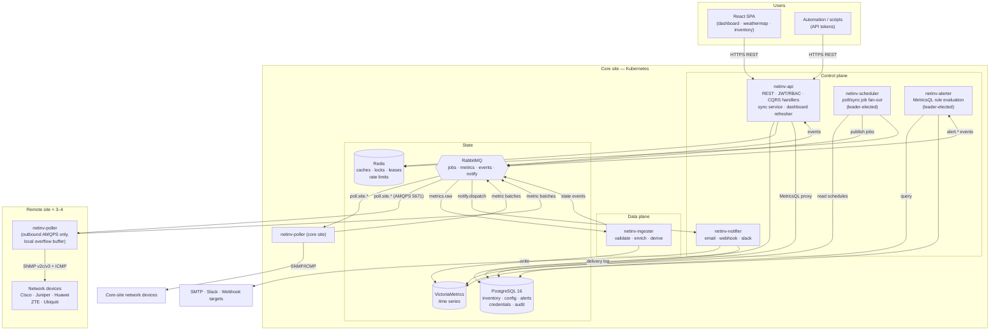
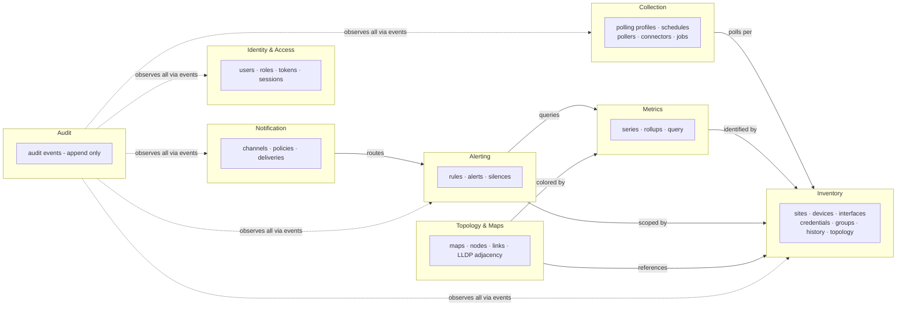

# 06 — High-Level Architecture Diagram

**Status:** draft · **Depends on:** 05

## System overview

## Reading the diagram

- **Left-to-right trust boundary:** users touch only the API over HTTPS; devices are touched only by pollers; nothing at a remote site accepts inbound connections (ADR-006).
- **Single writers:** PostgreSQL config/inventory written only by the API; VictoriaMetrics written only by the ingester. Everything else reads or goes through events — this is what keeps the modular monolith extractable (doc 05 §3).
- **RabbitMQ is the spine:** four logical flows (jobs out, metrics in, domain events around, notifications out) detailed in doc 05 §4.
- **Leader-elected singletons** (scheduler, alerter) are drawn once but deploy as ≥2 replicas with a Redis lease (doc 05 §9).

## Bounded-context view

Context ownership, aggregates, and language: doc 16. Package enforcement: doc 13.
