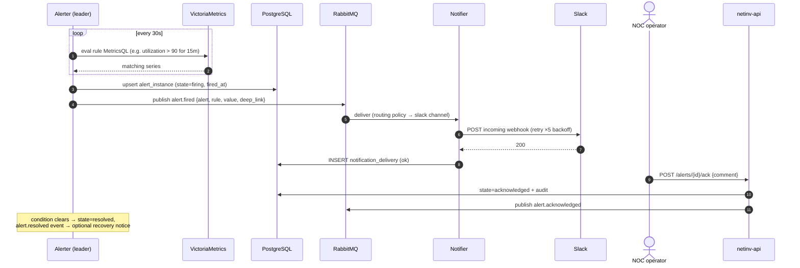
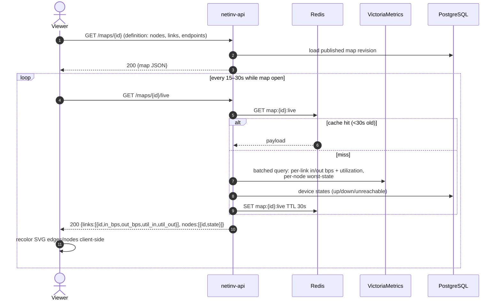
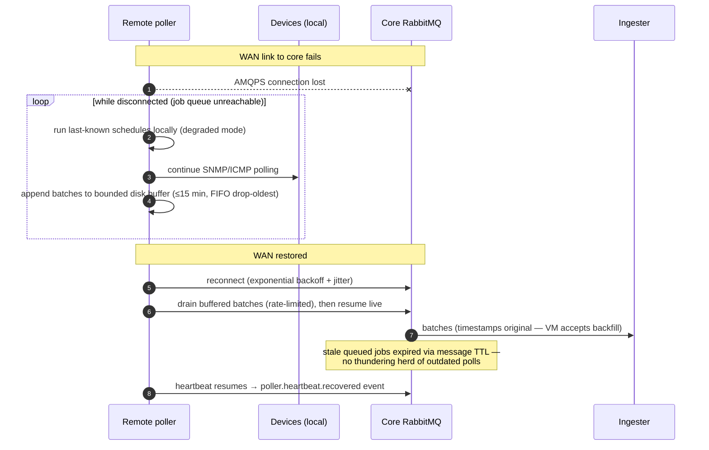

# 07 — Sequence Diagrams

**Status:** draft · **Depends on:** 05, 11

Six sequences cover the flows where timing/ordering is non-obvious. Simple CRUD is intentionally omitted.

## 1. Poll cycle (traffic family) — the hot path

```mermaid
sequenceDiagram
    autonumber
    participant S as Scheduler (leader)
    participant MQ as RabbitMQ
    participant P as Poller (site dc-east)
    participant D as Device
    participant I as Ingester
    participant VM as VictoriaMetrics

    loop every 10s tick
        S->>S: SELECT due schedules (next_due_at <= now)
        S->>MQ: publish PollJob{device, family=traffic, deadline}<br/>rk=site.dc-east
        S->>S: advance next_due_at += interval (jittered)
    end
    MQ->>P: deliver job (competing consumers)
    P->>P: acquire per-device semaphore
    P->>D: SNMP GETBULK ifHCInOctets, ifHCOutOctets,<br/>errors, discards, oper/admin status...
    D-->>P: varbinds
    P->>P: append samples to batch buffer
    alt batch full (500) or 5s elapsed
        P->>MQ: publish MetricBatch (protobuf+zstd), publisher-confirm
        MQ-->>P: confirm → release local buffer
    end
    P->>MQ: ack job
    MQ->>I: deliver MetricBatch
    I->>I: validate · enrich labels from inventory snapshot<br/>· derive utilization % · detect status transitions
    I->>VM: POST /api/v1/import (retry w/ backoff)
    VM-->>I: 204
    I->>MQ: ack batch; publish metrics.state.transition (if any)
    Note over S,VM: end-to-end target < 15 s p95 (NFR-15)
```

**Failure notes:** SNMP timeout → poller publishes `netinv_poll_success=0` sample (still a batch item) and acks the job (retry happens next cycle, not immediately — NFR-19). Poller crash mid-job → unacked job redelivered to another site poller. VM write failure → batch nacked/requeued (at-least-once; VM dedupes identical samples).

## 2. Device onboarding → first metrics

```mermaid
sequenceDiagram
    autonumber
    actor U as Operator
    participant API as netinv-api
    participant PG as PostgreSQL
    participant MQ as RabbitMQ
    participant P as Poller
    participant D as Device

    U->>API: POST /devices {name, ip, site, connector, credential, profile}
    API->>API: authorize (devices:write) · validate
    API->>PG: INSERT device (state=pending) + polling_schedule rows
    API->>PG: INSERT audit event
    API->>MQ: publish inventory.device.created
    API-->>U: 201 {device, state:pending}
    Note over MQ: scheduler picks up schedule on next tick;<br/>first job is family=inventory-sync (doc 11)
    MQ->>P: SyncJob{device}
    P->>D: SNMP: sysName/sysDescr/sysObjectID,<br/>ifTable/ifXTable, LLDP/CDP, entity MIB
    D-->>P: snapshot
    P->>MQ: publish SyncResult{snapshot}
    MQ->>API: (sync consumer) deliver SyncResult
    API->>PG: upsert interfaces · inventory fields ·<br/>asset_history entries · device.state=active
    API->>MQ: publish sync.completed + inventory.changed
    Note over P: traffic/health/icmp polling begins<br/>same cycle — device graphs live within ~2 min
```

## 3. Alert fire → notify → acknowledge



## 4. Login & token refresh

```mermaid
sequenceDiagram
    autonumber
    actor U as User (SPA)
    participant API as netinv-api
    participant PG as PostgreSQL
    participant R as Redis

    U->>API: POST /auth/login {username, password}
    API->>R: check lockout counter (FR-AUTH-04)
    API->>PG: fetch user · verify Argon2id
    API->>PG: INSERT refresh_token (hashed, family_id)
    API->>PG: audit login.success
    API-->>U: 200 {access_jwt (15m), refresh (httpOnly cookie)}
    Note over U: SPA calls API with Bearer JWT;<br/>API verifies signature + role claims locally (no DB hit)
    U->>API: POST /auth/refresh (cookie)
    API->>PG: validate + rotate (invalidate old, same family)
    alt reused/stale refresh token detected
        API->>PG: revoke entire token family
        API-->>U: 401 → re-login (audit: token.reuse)
    else valid
        API-->>U: 200 {new access_jwt, new refresh}
    end
```

## 5. Weathermap live view



One cached payload serves every viewer of the map (NOC wall = N viewers, 1 query set). v2 seam: replace polling with SSE push from the cache refresher.

## 6. Remote-site outage & recovery (poller buffering)



### 6.1 Reconnect must cancel the old consumer

Every consumer in this system runs inside a reconnect loop, and each iteration
has to cancel the consumer it replaces. It does that by giving each consumer its
own AMQP channel and closing it — `amqpx.Consume` returns a `stop` function for
exactly this.

On a shared channel a second `Consume` for the same queue registers an
*additional* consumer rather than replacing one: the channel never closes, so
the broker never cancels the original. RabbitMQ then round-robins deliveries
between a live consumer and one nobody reads, and the abandoned share sits
**unacked forever**.

The failure is quiet and partial, which is what makes it dangerous:

- the queue grows without bound, but nothing errors and nothing logs;
- the service keeps working on the fraction of messages that reach the live
  consumer, so metrics keep arriving and health stays green;
- only the messages routed to the dead consumer are lost.

Observed on the pilot on 2026-08-14, after a redeploy raced RabbitMQ's startup:
one site's job stream retried twice and ended with three consumers on one queue.
That site's gateway was losing roughly two polls in three — while still
reporting `poll_success` and still drawing graphs — behind a queue of 19 unacked
messages growing by about two a minute. Fixing it took fleet ingest from 32 to
50 rows/second, which is the measure of what had been vanishing.

Any new consumer belongs in the same shape: consume, read until the delivery
channel closes, `stop()`, then retry.
