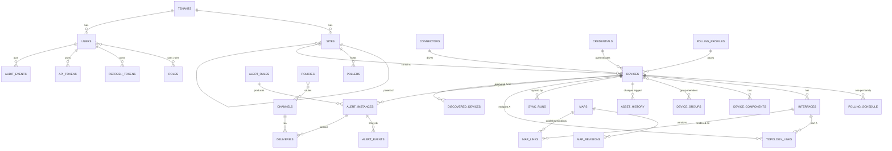

# 08 — Database Design & ER Diagram

**Status:** review · **Depends on:** 05, 15, 16

PostgreSQL 16. Conventions: PKs are ULIDs stored as `text` (sortable, generatable app-side, merge-safe) except append-heavy tables which use `bigint identity`. All timestamps `timestamptz` UTC. Every business table carries `tenant_id text NOT NULL DEFAULT 't_default'` (ADR-005; FK to `platform.tenants`; composite indexes lead with it only when multi-tenancy activates — v1 indexes omit it for size). Soft-state uses `status` enums (Postgres `CREATE TYPE`). Schemas per bounded context: `iam`, `platform`, `inventory`, `maps`, `alerting`, `notify`, `audit`, `config`. Migrations via `goose`, expand-migrate-contract (NFR-51). Time-series data lives in VictoriaMetrics, **not** here (doc 05 §6).

## Schema `iam`

### users
| Column | Type | Constraints |
|---|---|---|
| id | text | PK (ULID) |
| tenant_id | text | NN, FK platform.tenants |
| username | citext | NN, UNIQUE |
| email | citext | NN, UNIQUE |
| password_hash | text | NN (Argon2id PHC string) |
| display_name | text | NN |
| status | user_status | NN (`active`,`locked`,`deactivated`) |
| last_login_at | timestamptz | NULL |
| created_at / updated_at | timestamptz | NN |

### roles
`id` PK · `name` UNIQUE NN (`admin`,`operator`,`readonly`,`auditor`) · `description` · `permissions jsonb` NN (array of `resource:action`, doc 20 §5) · `is_builtin bool` NN. Custom roles post-v1 reuse this table (FR-RBAC-05).

### user_roles
`user_id` FK users ON DELETE CASCADE · `role_id` FK roles · `granted_by` FK users · `granted_at` NN · **PK (user_id, role_id)**.

### refresh_tokens
`id` PK · `user_id` FK users CASCADE · `token_hash` text NN UNIQUE (SHA-256) · `family_id` text NN (rotation family, FR-AUTH-02) · `issued_at` / `expires_at` NN · `rotated_at` NULL · `revoked_at` NULL · `client_meta jsonb` (ip, ua). Index: `(user_id)`, `(family_id)`, partial `(expires_at) WHERE revoked_at IS NULL` for purge job.

### api_tokens
`id` PK · `user_id` FK users CASCADE · `name` NN · `token_hash` UNIQUE NN · `scopes jsonb` NN · `expires_at` NULL · `last_used_at` · `revoked_at` · `created_at`. Index `(user_id)`.

## Schema `platform`

### tenants
`id` PK (`t_default` seeded) · `name` NN · `status` NN · `created_at`. Dormant in v1.

### sites
`id` PK · `tenant_id` · `name` UNIQUE-per-tenant NN · `parent_site_id` FK sites NULL (region→DC hierarchy, FR-PLT-01) · `location` · `contact` · `status` NN · timestamps. Index `(parent_site_id)`.

### pollers
`id` PK · `site_id` FK sites NN · `name` NN · `enrollment_token_hash` NULL (consumed on registration) · `status` NN (`pending`,`active`,`disabled`) · `version` · `last_heartbeat_at` · `stats jsonb` (queue depth, polls/s) · timestamps. Index `(site_id)`, partial `(last_heartbeat_at) WHERE status='active'` (stale-poller alerting).

### connectors
Catalog of registered connector plugins (FR-PLT-03): `id` PK (e.g. `cisco-ios`) · `vendor` NN · `display_name` NN · `version` NN · `capabilities jsonb` NN (metric families, MIB deps) · `sys_object_id_prefixes jsonb` (auto-match, doc 11) · `enabled bool` NN. Seeded by app at startup from the compiled registry (code is source of truth; table exists for UI/joins).

### polling_profiles
`id` PK · `tenant_id` · `name` UNIQUE NN · `traffic_interval_s int` NN DEFAULT 60 · `health_interval_s` NN 300 · `icmp_interval_s` NN 30 · `sync_interval_s` NN 21600 · `snmp_timeout_ms` NN 5000 · `snmp_retries` NN 2 · `bulk_max_repetitions` NN 25 · `families_enabled jsonb` NN DEFAULT `["traffic","health","icmp","sync"]` — the per-family switch (FR-COLL-04); a family absent from this list is not scheduled, and any existing schedule row for it is dropped when a device moves onto the profile. Intervals cannot express "off": their CHECK constraints require a positive value · `is_default bool`. Referenced by devices; edits fan out on next scheduler tick.

### polling_schedule
One row per device × family — the scheduler's work source. `id bigint identity` PK · `device_id` FK inventory.devices CASCADE NN · `family` poll_family NN (`traffic`,`health`,`icmp`,`sync`) · `interval_s int` NN (denormalized from profile at write) · `next_due_at timestamptz` NN · `last_run_at` · `last_status` · **UNIQUE (device_id, family)** · **Index `(next_due_at) WHERE enabled`** — the hot scheduler scan. `enabled bool` NN.

### sync_runs
`id` PK · `device_id` FK NN · `trigger` NN (`scheduled`,`manual`,`onboarding`) · `started_at` / `finished_at` · `status` NN (`running`,`ok`,`partial`,`failed`) · `changes_count int` · `error text` · `stats jsonb`. Index `(device_id, started_at DESC)`; retention 90 d purge job.

### site_collection_health
One row per site, written by the scheduler (migration 0013). `site_id` PK FK platform.sites CASCADE · `consumers int` NN · `queued int` NN · `no_consumer_since timestamptz` NULL · `checked_at timestamptz` NN.

It exists because a site nobody polls is otherwise invisible. The scheduler declares each site queue before publishing to it, so every job is routable and simply accumulates unread: the publish succeeds, nothing fails, nothing is logged, and the devices are never polled. `queue.declare` returns the consumer count, and that was being discarded. `no_consumer_since` is set on the first observation with none and cleared as soon as one appears, so it answers "since when" rather than "is it bad now" — a poller restarting passes through zero, and the instant is what makes the state actionable. Deliberately not a metric: the device page reads it in the same request that reads the device, and it has to be true on a deployment where `platform.pollers` is empty, which is the normal local-mode configuration.

### discovery_rules (P1)
`id` PK · `site_id` FK NN · `cidr` NN · `credential_ids jsonb` NN (candidates to try) · `schedule_cron` NULL · `enabled` · timestamps.

### discovered_devices (P1)
`id` PK · `rule_id` FK discovery_rules · `ip inet` NN · `sys_object_id` · `sys_descr` · `matched_connector_id` FK connectors NULL · `responding_credential_id` NULL · `state` NN (`pending`,`approved`,`ignored`) · `seen_first_at`/`seen_last_at` · UNIQUE `(rule_id, ip)`.

## Schema `inventory`

### credentials
Envelope-encrypted (ADR-011, doc 20 §7): `id` PK · `tenant_id` · `name` UNIQUE NN · `kind` NN (`snmp_v2c`,`snmp_v3`) · `enc_payload bytea` NN (AES-256-GCM ciphertext of the JSON secret) · `enc_dek bytea` NN (DEK wrapped by master key) · `key_version int` NN (rotation) · `meta jsonb` NN (non-secret: v3 username, auth/priv protocol names — for UI display) · `created_by` FK iam.users · timestamps. **No plaintext secret columns exist.**

### devices
| Column | Type | Constraints |
|---|---|---|
| id | text | PK (ULID) |
| tenant_id | text | NN |
| site_id | text | NN, FK platform.sites |
| connector_id | text | NN, FK platform.connectors |
| credential_id | text | NN, FK credentials RESTRICT (FR-CRED-02) |
| profile_id | text | NN, FK platform.polling_profiles |
| name | text | NN |
| mgmt_ip | inet | NN |
| status | device_status | NN (`pending`,`active`,`unreachable`,`disabled`,`retired`) |
| sys_name / sys_descr / sys_object_id / sys_location / sys_contact | text | NULL (from sync) |
| vendor / model / serial_number / os_version | text | NULL |
| uptime_basis | timestamptz | NULL (last sysUpTime reset detection) |
| tags | jsonb | NN DEFAULT '[]' |
| notes | text | |
| attrs | jsonb | NN DEFAULT '{}' (connector-specific extras) |
| wan_capacity_bps | bigint | NULL, CHECK > 0. Subscribed uplink rate, stated by an operator because SNMP cannot report one — a PPPoE interface returns 0 for both ifSpeed and ifHighSpeed. Weathermap links whose interfaces report no speed divide by `min()` of the two ends (FR-MAP-08) |
| retired_at | timestamptz | NULL |
| created_at / updated_at | timestamptz | NN |

Indexes: UNIQUE `(tenant_id, mgmt_ip) WHERE status != 'retired'` · `(site_id)` · `(connector_id)` · `(status)` · GIN `(tags)` · search: GIN `to_tsvector(name || sys_name || sys_descr || model || serial_number)` (FR-DEV-03) + trigram on `name`, `serial_number`.

### interfaces
`id` PK · `device_id` FK devices CASCADE NN · `if_index int` NN · `name` (ifName) · `alias` (ifAlias) · `descr` · `if_type int` · `mtu int` · `speed_bps bigint` (ifHighSpeed×1e6 where the agent populates it, else ifSpeed — see doc 10) · `phys_address macaddr` NULL · `admin_status`/`oper_status` int (last synced snapshot; live state in VM) · `monitor bool` NN DEFAULT true (per-interface polling opt-out) · `state` NN (`present`,`missing`,`removed`) — FR-SYNC-03 · `missing_since` NULL · `ever_up bool` NN DEFAULT false — monotonic, set the first time sync observes the port operationally up and never cleared; interface-down alerts are suppressed while it is false (FR-ALR-08) · timestamps. **UNIQUE `(device_id, if_index)` WHERE `state='present'`** — partial, because an ifIndex identifies an interface among the ones a device presents *now*, not for all time. Agents renumber across reboots, and the unconditional constraint this replaced (migration 0011) made a legal reindex unrepresentable: the sync transaction aborted and retried forever while inventory froze (doc 11 §3.1). Retired rows keep their last-known index for history without blocking its reuse. `customer text` NULL and `tags jsonb` NN DEFAULT `[]` are **operator-owned and never written by sync** (migration 0017): ifAlias is where this information usually lives and it is the *device's* field, so a reprovision or a different engineer overwrites it, the next sync follows, and a customer identified by an ifAlias substring silently stops being identifiable. `customer` is a column rather than a tag because it is the axis reports group by. Index `(device_id)`, trigram `(alias)`, trigram `(customer)` for the search box, and `lower(customer)` for the exact filter a billing run needs.

### device_components
Sensors/PSUs/fans/modules from ENTITY-MIB & vendor MIBs: `id` PK · `device_id` FK CASCADE · `kind` NN (`cpu`,`memory_pool`,`temp_sensor`,`fan`,`psu`,`module`,`stack_member`,`optic`) · `source_index` text NN (MIB index path) · `name` NN · `model`/`serial` · `state` (`present`,`missing`,`removed`) · `attrs jsonb` · timestamps. UNIQUE `(device_id, kind, source_index)`.

### device_groups / device_group_members
`device_groups`: `id` PK · `tenant_id` · `name` UNIQUE NN · `description` · `dynamic_filter jsonb` NULL (saved-filter groups, P1). `device_group_members`: **PK (group_id, device_id)**, both FK CASCADE.

### asset_history
Append-only change log (FR-DEV-07): `id bigint identity` PK · `device_id` FK NN · `object_kind` NN (`device`,`interface`,`component`) · `object_id` text NN · `field` NN · `old_value` / `new_value` text · `change_kind` NN (`created`,`updated`,`removed`,`status`) · `sync_run_id` FK platform.sync_runs NULL · `detected_at` NN. Index `(device_id, detected_at DESC)`; partitioned by month (`detected_at`) for cheap retention drops.

### topology_links
LLDP/CDP adjacency (doc 11 §topology): `id` PK · `a_device_id` FK NN · `a_if_id` FK interfaces NULL · `b_device_id` FK NULL (NULL = unmanaged neighbor) · `b_if_id` NULL · `b_sysname`/`b_port_descr`/`b_chassis_id` text (as-reported) · `protocol` (`lldp`,`cdp`) · `state` (`active`,`stale`) · `first_seen_at`/`last_seen_at` NN. UNIQUE `(a_device_id, a_if_id, b_chassis_id, b_port_descr)`; index `(b_device_id)`.

## Schema `maps`

### maps
`id` PK · `tenant_id` · `name` UNIQUE NN · `description` · `background jsonb` NULL (P1 image ref, dims) · `options jsonb` NN (grid, scale thresholds) · `min_role` NN (visibility floor, FR-MAP-01) · `published_rev int` NN DEFAULT 0 · `created_by` FK users · timestamps.

### map_revisions
Draft/publish + undo history (FR-MAP-02): `map_id` FK maps CASCADE · `rev int` NN · `state` (`draft`,`published`,`archived`) · `definition jsonb` NN (full nodes+links document, schema doc 09 §maps) · `saved_by` FK users · `saved_at` · **PK (map_id, rev)**.

### map_links
Extraction of interface bindings from the published revision, maintained transactionally on publish — gives referential integrity + fast "which maps show this interface": `map_id` FK CASCADE · `link_key` text (id within definition) · `a_if_id` FK inventory.interfaces · `b_if_id` NULL · **PK (map_id, link_key)** · index `(a_if_id)`.

## Schema `alerting`

### alert_rules
`id` PK · `tenant_id` · `name` UNIQUE NN · `kind` NN (`threshold`,`state`,`inventory`) · `severity` NN (`critical`,`warning`,`info`) · `expr text` (MetricsQL for threshold kind) · `condition jsonb` NN (operator, value, for_duration_s, event matcher) · `scope jsonb` NN (all | site_ids | group_ids | device_ids | interface_selector) · `enabled bool` NN · `is_builtin bool` (default pack, FR-ALR-07) · `annotations jsonb` (message template, runbook URL) · timestamps. Index `(enabled)`.

### alert_instances
`id` PK · `rule_id` FK alert_rules NN · `fingerprint` text NN (rule+labels hash — dedupe key) · `state` NN (`firing`,`acknowledged`,`resolved`,`flapping`) · `severity` NN (copied) · `device_id` FK NULL · `interface_id` FK NULL · `labels jsonb` NN · `value double precision` · `fired_at` NN · `acked_at`/`acked_by`/`ack_comment` · `resolved_at` · `flap_count int` NN DEFAULT 0 · `last_eval_at`. **UNIQUE `(rule_id, fingerprint) WHERE state != 'resolved'`** (one live instance per series); indexes `(state, severity, fired_at DESC)` (the alert panel query), `(device_id)`.

### alert_events
Append-only lifecycle log: `id bigint identity` PK · `alert_id` FK alert_instances CASCADE · `event` NN (`fired`,`acked`,`resolved`,`re-fired`,`flap_start`,`flap_end`,`silenced`) · `actor_id` FK users NULL · `detail jsonb` · `at` NN. Index `(alert_id, at)`.

### silences
`id` PK · `tenant_id` · `scope jsonb` NN · `reason` text NN · `starts_at`/`ends_at` NN · `created_by` FK users NN · `revoked_at` NULL. Partial index `(ends_at) WHERE revoked_at IS NULL`.

## Schema `notify`

### channels
`id` PK · `tenant_id` · `name` UNIQUE NN · `kind` NN (`email`,`webhook`,`slack`) · `config jsonb` NN (non-secret: addresses, URL host shown redacted) · `enc_secret bytea` / `enc_dek` / `key_version` (SMTP password, webhook HMAC key, Slack URL — same envelope scheme as credentials) · `enabled` NN · timestamps.

### policies
`id` PK · `tenant_id` · `name` NN · `match jsonb` NN (severities, scope) · `channel_ids jsonb` NN · `enabled` · `order int` NN (first-match-wins evaluation). 

### deliveries
`id bigint identity` PK · `alert_id` FK alerting.alert_instances NN · `channel_id` FK channels NN · `event` NN (`fired`,`resolved`) · `status` NN (`ok`,`retrying`,`failed`) · `attempts int` NN · `last_error` text · `queued_at`/`delivered_at`. Index `(alert_id)`, partial `(status) WHERE status='failed'`; 90 d retention.

## Schema `audit`

### events
Append-only (FR-AUD-02): `id bigint identity` PK · `tenant_id` NN · `at timestamptz` NN · `actor_kind` NN (`user`,`api_token`,`system`) · `actor_id` text NULL · `action` text NN (dot-namespaced: `auth.login.success`, `device.update`, `device.purge`, `device.oid_walk`, `sync.completed`, `map.delete`, `alert_rule.create` / `.update` / `.delete` / `.set_enabled`, `api.error`). Destructive acts capture the human-readable name in `before` — an audit row naming only an id nobody can resolve afterwards is close to useless — and `alert_rule.set_enabled` is audited because disabling a rule silences monitoring · `resource_kind` / `resource_id` text · `before jsonb` / `after jsonb` (config diffs, secrets always redacted) · `source_ip inet` · `user_agent` text · `trace_id` text · `detail jsonb`. **Range-partitioned by month on `at`**; indexes per partition: `(at DESC)`, `(actor_id, at DESC)`, `(action, at DESC)`, `(resource_kind, resource_id)`. No UPDATE/DELETE grants to the app role; retention = detach+archive partition (doc 20 §10).

## Schema `config`

### settings
`key text` PK · `tenant_id` · `value jsonb` NN · `value_schema` text NN (validation ref, FR-SET-04) · `updated_by` FK users · `updated_at`. Seeded defaults; SMTP secrets live in `notify.channels`, not here.

### user_preferences
`user_id` PK FK iam.users CASCADE · `theme` NN DEFAULT 'system' · `landing_page` · `timezone` · `prefs jsonb`.

## ER diagram (core relationships)

## Normalization & design notes

- 3NF throughout config/inventory; deliberate denormalization: `polling_schedule.interval_s` (scheduler scan avoids join), `alert_instances.severity` (panel sort without rule join), `map_links` (projection of JSONB for integrity/speed). Each is refreshed transactionally with its source.
- JSONB is used for open-shaped data only (tags, connector attrs, scopes, map definitions) — never for data we filter hot paths on without a GIN index.
- Historical tables: `asset_history`, `alert_events`, `audit.events`, `sync_runs` are append-only; the two biggest are month-partitioned so retention is `DROP PARTITION`, not `DELETE`.
- Purge/retention jobs (scheduler-owned): expired tokens, old sync_runs/deliveries, audit/asset partitions per doc 04 §4.
- Seed data (migration 0002): default tenant, builtin roles, default polling profile, builtin alert rule pack, connector catalog rows, admin user (forced password change).

## Migrations

Goose, embedded in the binary and applied by the API at startup. Every change ships as a new numbered file; none are edited in place.

| # | What | Why |
|---|---|---|
| 0001 | Full schema | Baseline |
| 0002 | Seed | Default tenant, builtin roles, default polling profile, builtin alert rule pack, connector catalog, admin user (forced password change) |
| 0003 | `users.must_change_password` | Bootstrap admin has to rotate its seeded password |
| 0004 | `interfaces.miss_streak` | Deleted-asset detection needs consecutive-miss counting (FR-SYNC-03) |
| 0005 | Builtin rules → MetricsQL | The metric families the shipped pack refers to now exist; rules whose event sources do not are disabled rather than left firing nothing |
| 0006 | Memory rule as a percentage | The original expression divided two gauges that are not always both present |
| 0007 | `discovered_devices.sys_name` | Discovery results are unreadable as bare IPs |
| 0008 | `interfaces.ever_up` | Distinguishes "never worked" from "stopped working"; backfilled from the current `oper_status` so nothing goes quiet waiting for a first sync (FR-ALR-08) |
| 0009 | `devices.wan_capacity_bps` | SNMP cannot report a PPPoE plan rate, so an operator states it (FR-MAP-08) |

`TestMigrateUpDownUp` (`internal/platform/pgx`) applies every migration up, down to zero and up again in a throwaway database, so down-migrations stay real rather than decorative.
