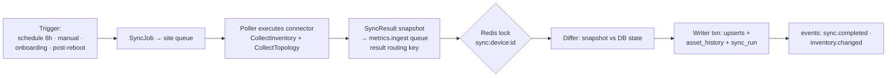

# 11 — Synchronization Flow (Discovery, Change & Delete Detection)

**Status:** draft · **Depends on:** 05, 08, 10 · sequence view in 07 §2

Sync = keeping PostgreSQL inventory truthful about the network. Metrics flow continuously (doc 05 §5); sync is the slower structural loop. Owner: sync application service in the API's Inventory context (v1), fed by pollers.

## 1. Sync pipeline (per device)



**Triggers:** scheduled (profile `sync_interval_s`, default 6 h, jittered); manual (`POST /devices/{id}/sync`, FR-SYNC-01); onboarding (first job, doc 07 §2); reactive — ingester detecting `sysUpTime` reset (reboot ⇒ ifIndex may have shifted) or `ifOperStatus` on an unknown ifIndex emits `sync.requested`.

**Snapshot contents:** system group, full interface table (ifTable+ifXTable), entity/components, LLDP/CDP adjacency, vendor inventory extras (connector capability-dependent).

## 2. Pagination & device-friendliness

SNMP's "pagination" is GETBULK iteration: the SDK `Walk` pages with `max-repetitions` from the polling profile (default 25), honoring per-device semaphore (FR-COLL-10) and inter-request pacing (default 20 ms) so a 4k-interface chassis walk doesn't monopolize the device CPU. Large walks stream varbinds to the connector incrementally; snapshots cap at 10k interfaces/device (beyond = `partial` with error detail).

## 3. Change detection (FR-SYNC-02)

The differ compares snapshot → stored state per object class:

- **Interfaces — identity resolution first** (FR-DEV-09): match priority (1) same `ifIndex` + same `ifName`; (2) same `ifName` (ifIndex shifted after reboot/linecard swap — update ifIndex, log `reindexed`); (3) same `phys_address`+`ifType` when names changed. Unmatched snapshot rows = new; unmatched DB rows = missing-candidate (§4).
- **Fields diffed:** device: sysName/Descr/Location/Contact, model, serial, os_version; interface: name, alias, speed, MTU, admin/oper snapshot, type; components: state, model, serial.
- Every difference → one `asset_history` row (field, old, new, sync_run_id) + aggregated `inventory.changed` event. Serial-number or model change on a device is flagged `hardware_replaced` (warning-eligible, FR-ALR-01 inventory kind).
- **Conflict resolution policy:** the device is authoritative for everything it reports (network truth beats DB), **except** operator-owned fields (display name, tags, notes, monitor flags, site, group membership) which sync never touches. There is no merge ambiguity because the two ownership sets are disjoint. Concurrent syncs are impossible per device (Redis lock, FR-SYNC-06); concurrent operator edits win because sync only writes device-owned columns.

### 3.1 Applying a reindex — ifIndex is unique among *present* interfaces only

Identity resolution rule (2) above means an interface can keep its row and
change its `ifIndex`, which is what makes a weathermap link survive a reboot.
Persisting it takes care, because the index it is moving *to* may still be held
by another row of the same device. `Apply` runs three steps in this order:

1. **Retire what vanished** — the missing/removed lifecycle updates run *first*,
   releasing the ifIndexes of rows that are no longer present.
2. **Park the rows being reassigned** at the negative of their current index.
   Two live interfaces can *swap* ifIndexes across a reboot, and retiring rows
   does nothing for that: updating either one first collides with the other.
   Negatives never escape the transaction.
3. **Write the reported interfaces**, claiming the now-free indexes.

The unique constraint is therefore **partial — `(device_id, if_index) WHERE
state = 'present'`** (migration 0011). Retired rows keep their last-known index
for history without blocking its reuse.

The unconditional constraint this replaced made a legal reindex
unrepresentable. A pilot UniFi gateway rebooted, moved `ppp2` from ifIndex 76 to
41 where a long-retired row still sat, and the sync transaction aborted on
`duplicate key value violates unique constraint`. Because a failed sync result
is requeued (§6), it retried **every second indefinitely** — 134 attempts before
anyone looked. Inventory froze at the pre-reboot topology, and the failure was
invisible from the outside: polling carried on, the device was up, and the only
symptom was a weathermap link that had gone flat.

**Consumers must resolve ifIndex, not store it.** A weathermap link records the
ifIndex current when it was drawn, so the live assembler resolves the index from
`maps.map_links`' stable interface row id at render time and treats the saved
value as a fallback (doc 12 §4). Anything else that pins an ifIndex will go
quietly wrong the next time a device renumbers.

## 4. Deleted-asset detection (FR-SYNC-03)

Absence must be observed repeatedly before acted on:

```
present ──(missing in 1 sync)──▶ missing (missing_since=now, history row, no alert)
missing ──(missing in N=3 consecutive syncs)──▶ removed (history row + inventory.changed;
        interface leaves polling; map links referencing it render grey + editor warning)
missing ──(reappears)──▶ present (history row `restored`)
```

Devices are never auto-deleted: ICMP/SNMP failure ⇒ `unreachable` (alerting concern); only operators retire (FR-DEV-08). Retired devices stop scheduling immediately (scheduler filters on status) and their series naturally age out of VM by retention.

## 5. Incremental sync

Full walks every cycle would be wasteful and slow on big chassis:

- **Cheap change probes first:** `ifTableLastChange`, `ifStamp`/vendor equivalents, `sysUpTime`, and interface count via `ifNumber`. If unchanged since last sync → record `sync_run(status=ok, changes=0)` skipping the full walk (typical case; turns the 6 h cycle into a few GETs).
- LLDP walk always runs (adjacency changes don't bump ifTableLastChange).
- Full resync forced: after reboot detection, connector version change, manual trigger, or every 7th cycle (safety net against probe lies).

## 6. Retry & failure policy (aligned with doc 23)

| Failure | Handling |
|---|---|
| SNMP timeout mid-walk | 2 in-job retries (profile), then `sync_run=failed`; scheduler backs off: next attempt 2× interval, cap 24 h; device flagged `sync_degraded` in UI |
| Auth failure | `sync_run=failed(auth)`; emits event → builtin warning alert (credential likely rotated); no tight retry (avoids lockouts on devices with SNMPv3 auth-failure traps) |
| Partial walk (some MIBs) | `status=partial`; present data applied; missing families noted; counts toward missing-N only for families that succeeded before |
| Result queue outage | SyncResults ride the same durable queue/buffering as metrics (doc 07 §6) |
| Differ crash / bad data | txn rollback — inventory is never half-updated; job DLQ'd for inspection |

## 7. Discovery (P1) & connector auto-match

Subnet sweep (FR-SYNC-04): expand CIDR → ICMP probe (liveness) → SNMP probe with each candidate credential (stop at first success) → read system group → **connector match**: registry scored by `sysObjectID` prefix (longest match wins; `generic` floor) → row in `discovered_devices` (pending). Operator approves (assign site/profile/name) → normal onboarding path (doc 07 §2). Re-runs update `seen_last_at`; already-managed IPs are skipped. Sweeps run on the target site's poller, rate-limited (default 64 concurrent probes) to be IDS-friendly; every sweep is audit-logged.

## 8. Parallelism & scale summary

Per-device: strictly serial (lock). Across devices: bounded only by poller worker pools and queue depth — 100k devices ÷ (50 sites × 200 workers) keeps the 6 h sync cycle trivially feasible; the differ/writer scales with API replicas as sync-result consumers (competing consumers, per-device lock preserving correctness).
