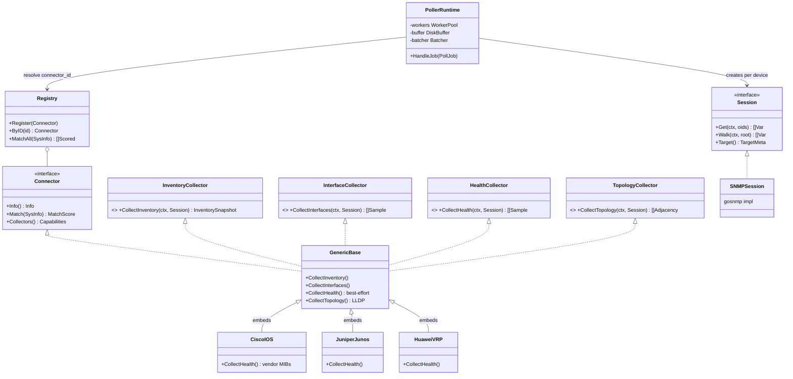
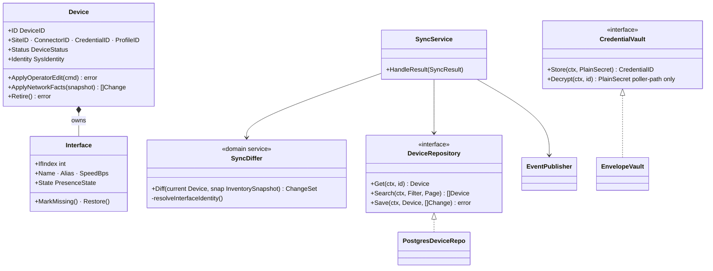
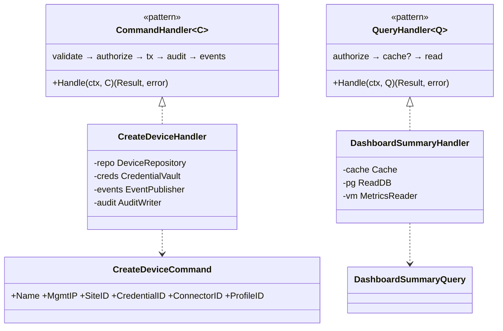

# 17 — Class Diagram

**Status:** draft · **Depends on:** 10, 13, 16

Key types and interfaces per context — the *shape* of the code, not every field. Go has no classes; boxes are structs/interfaces, `<<interface>>` = Go interface, composition arrows = embedding.

## 1. Connector SDK & poller runtime (the plugin seam)



## 2. Inventory context (aggregate + sync)



## 3. Application layer pattern (CQRS-lite, doc 05 §1) — one example each



## 4. Alerting & notification

```mermaid
classDiagram
    class AlertRule {
        +Kind threshold|state|inventory
        +Expr MetricsQL
        +Scope
        +Fingerprint(labels) string
    }
    class AlertInstance {
        +State firing|acked|resolved|flapping
        +Ack(user, comment) error
        +Resolve(at) error
        +RegisterFlap() bool
    }
    class RuleEvaluator {
        <<domain service>>
        +Evaluate(rule, results, now) []Transition
    }
    class MetricsReader { <<interface>> +Query(ctx, expr, at) }
    class AlertRepository { <<interface>> +UpsertLive() +Transition(cas) }
    class RoutingService { +Route(alert, []Policy) []ChannelDispatch }
    class Sender { <<interface>> +Send(ctx, Rendered) error }
    class SMTPSender ; class SlackSender ; class WebhookSender

    RuleEvaluator --> MetricsReader
    RuleEvaluator --> AlertRepository
    AlertRule "1" --> "*" AlertInstance
    RoutingService --> Sender
    Sender <|.. SMTPSender
    Sender <|.. SlackSender
    Sender <|.. WebhookSender
```

## 5. Platform kernel interfaces (shared, doc 13)

```mermaid
classDiagram
    class TokenVerifier { <<interface>> +Verify(raw) Claims }
    class LocalJWTVerifier ; class OIDCVerifier { future Keycloak }
    class KeyProvider { <<interface>> +WrapDEK() +UnwrapDEK() }
    class EnvMasterKey ; class VaultProvider { future }
    class EventPublisher { <<interface>> +Publish(ctx, Event) }
    class Cache { <<interface>> +GetJSON +SetJSON +Invalidate }
    class Lock { <<interface>> +Acquire(key, ttl) Lease }
    class Clock { <<interface>> +Now() }
    TokenVerifier <|.. LocalJWTVerifier
    TokenVerifier <|.. OIDCVerifier
    KeyProvider <|.. EnvMasterKey
    KeyProvider <|.. VaultProvider
```

The two `future` implementations (OIDCVerifier, VaultProvider) are the concrete seams promised by ADR-010/011 — swap by configuration, no call-site changes.
