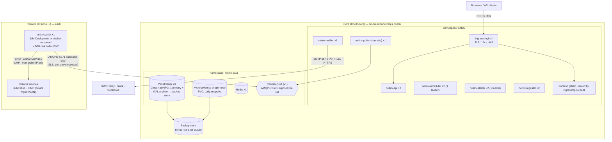

# 18 — Deployment Diagram

**Status:** draft · **Depends on:** 05, 06 · k8s detail: 19

## Physical topology (v1: core site + 3–4 remote sites)

## Network paths & firewall matrix

| From | To | Proto/Port | Notes |
|---|---|---|---|
| Users | Ingress | TCP 443 | only user-facing entry |
| Remote poller | Core RabbitMQ LB | TCP 5671 (AMQPS) | **only** core-bound port from sites; per-site vhost credentials (doc 20 §8) |
| Poller | Devices | UDP 161, ICMP | source-restrict SNMP ACLs on devices to poller IPs |
| Notifier | SMTP/Slack/webhooks | 587/443 egress | allowlist egress if policy requires |
| CI (GitHub) | — | none inbound | cluster **pulls** images from GHCR (doc 25); no GitHub→on-prem path |
| Admin | k8s API | 6443 | platform ops only, not app traffic |

Remote sites need zero inbound rules (ADR-006). If a site's WAN dies, its poller buffers ≥15 min and device SNMP data survives the gap (doc 07 §6); core keeps serving other sites.

## Sizing (v1, 500 devices — revisit at NFR capacity triggers)

| Component | Replicas | CPU req/lim | Mem req/lim | Storage |
|---|---|---|---|---|
| api | 2 | 250m/1 | 256Mi/512Mi | — |
| scheduler / alerter | 2 each | 100m/500m | 128Mi/256Mi | — |
| ingester | 2 | 250m/1 | 256Mi/512Mi | — |
| notifier | 1 | 50m/250m | 64Mi/128Mi | — |
| poller (per site) | 1 | 250m/1 | 256Mi/512Mi | 2Gi buffer PVC |
| PostgreSQL | 1 (+replica S19) | 1/2 | 2Gi/4Gi | 50Gi |
| VictoriaMetrics | 1 | 1/2 | 2Gi/4Gi | 100Gi (doc 04 §4) |
| Redis | 1 | 100m/500m | 256Mi/512Mi | — (cache-only, no persistence needed) |
| RabbitMQ | 1 → 3 (HA phase) | 500m/1 | 512Mi/1Gi | 10Gi |

Whole v1 core fits in ~8 vCPU / 16 GiB — one modest node pool; remote poller runs on anything that runs a container.
