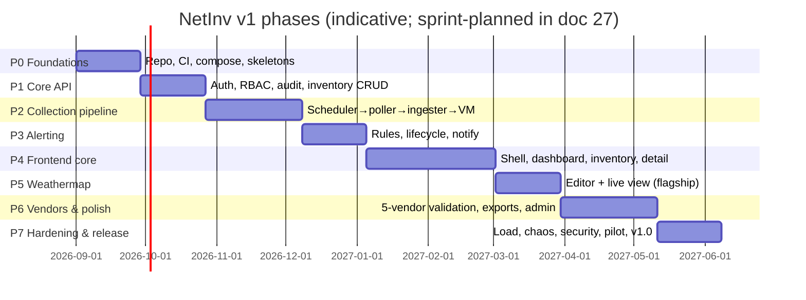

# 26 — Development Roadmap

**Status:** draft · **Depends on:** 02 (priorities), 04, 27 (sprint detail)

Backend-first in small phases (product-owner directive): each phase ends with something *provably working end-to-end*, because a solo-dev project dies from long stretches of nothing-demonstrable. 20 sprints × 2 weeks ≈ 10 months (doc 27 maps phases → sprints).

## Phase gates (each phase has a demo + exit criteria)

| Phase | Exit criteria (demoable) | Milestone |
|---|---|---|
| **P0 Foundations** | `make dev` boots compose stack incl. snmpsim; CI green on skeleton; migrations run; hello-world from each of the 6 binaries | — |
| **P1 Core API** | Login → JWT → RBAC-enforced device/site/credential CRUD via curl; audit rows appear; authz matrix tests green | — |
| **P2 Collection** | Onboard simulated device via API → metrics queryable in VM within 2 min; generic connector full IF-MIB + system; poller buffering survives RabbitMQ restart | **M1 pipeline live (S6)** |
| **P3 Alerting** | Builtin rule pack fires on simulated failure → Slack + email within 60 s; ack via API; sync change detection writes asset history | **M2 alerting (S9)** |
| **P4 Frontend core** | Browser: dashboard panels (summary, alerts, top-N, heatmap, graphs), inventory search/filter/export, device detail with live graphs, dark mode | **M3 usable product (S14)** |
| **P5 Weathermap** | Create map, place nodes, bind LLDP-suggested links, publish; NOC view shows live utilization colors ≤30 s | **M4 flagship (S16)** |
| **P6 Vendors & polish** | Real-hardware validation ≥3 vendors; cisco/juniper/huawei/zte/ubiquiti connectors with health MIBs; settings/users/audit UIs; CSV/XLSX (+PDF P1) exports; poller fleet UI | — |
| **P7 Hardening** | 500-device load meets NFRs; chaos-lite pass; security checklist (doc 20 §12); backup/restore drill; Helm quickstart <30 min verified; pilot on the owner's 4–5 sites | **M5 v1.0 (S20)** |

## Ordering rationale

- **Pipeline before UI** (P2 ≺ P4): the riskiest engineering (SNMP at scale, queue semantics, TSDB) gets the most calendar time to bake; the UI then builds on data that already flows.
- **Alerting before frontend**: alerts are API-complete early so the dashboard's alert panel is real on day one of P4, and the platform is *useful headless* (API + Slack) from M2 — genuine value 4 months before v1.0.
- **Weathermap after frontend core**: the flagship deserves a mature component base (charts, live-data hooks, theming) rather than being built on wet cement.
- **Vendor depth late but validated early**: generic connector covers all vendors' traffic/system from P2; vendor *health* MIBs land in P6 against real iron — the highest-uncertainty external dependency (R-07) is isolated where slips can't block the release skeleton.

## Post-v1 (sequenced in doc 29)

v1.1 discovery GA + maintenance windows + PDF reports → v1.2 L2/L3 metric families → v1.3 syslog/traps + events stream GA → v2.0 Keycloak + HA + multi-tenant activation → SaaS track.
