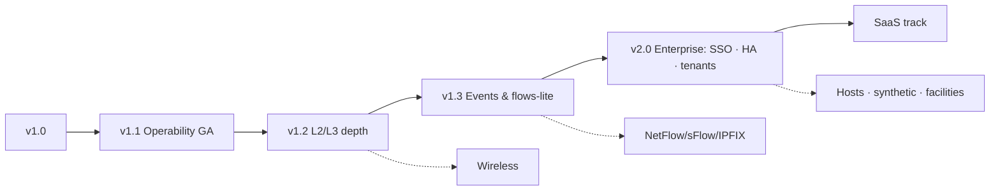

# 29 — Future Enhancement Roadmap

**Status:** draft · **Depends on:** 02 §4.8, 26 · every item below already has a named seam in the v1 design

## Sequencing map

## v1.1 — Operability GA (fast-follow, ~2 sprints)
Discovery UI GA (backend shipped P1) · maintenance windows · PDF reports (availability/SLA templates for Priya persona) · events stream UI · map background images · MFA (TOTP; schema reserved) · SSE push for live panels (seam: `api/client.ts`, doc 14).

## v1.2 — L2/L3 metric families (categories 4–5)
MAC table size, STP topology changes, errdisabled/storm-control (L2) · route/ARP table sizes, BGP session state + prefix counts (BGP4-MIB + vendor), OSPF neighbors, VRRP/HSRP transitions (L3). Design impact: **none structural** — new collector capability interfaces in the SDK (`L2Collector`, `RoutingCollector`), new metric names, new builtin rules; connectors deepen independently (ADR-014). BGP peer state belongs on the weathermap (node badge) — small map schema addition (`netinv.map/2`, versioned per FR-MAP-07).

## v1.3 — Events & early flow
- **Syslog + SNMP trap ingestion** (deferred C4): new intake service (`netinv-events`) → RabbitMQ → PG events store + correlation with alerts ("what changed when the graph bent" — PRD dashboard g). Seam: events.domain bus + recent-events panel already exist.
- **Flows-lite:** sFlow/NetFlow v5 top-talkers only (category 11's highest-value slice) via a dedicated `netinv-flow` collector writing aggregated (not per-flow) series to VM — full IPFIX with raw-flow storage (ClickHouse) is a separate later ADR; do not let flow storage decisions leak into v1.x.

## v2.0 — Enterprise
- **Keycloak/OIDC** (ADR-010 seam: `TokenVerifier` swap + SPA redirect flow; local accounts remain as break-glass).
- **HA:** RabbitMQ 3-node quorum, CNPG synchronous replica + automated failover, vmcluster, multi-replica everything (leases already handle singleton failover), PgBouncer. Deployment-shape change per ADR-004/doc 19 §8.
- **DR:** second-site warm standby fed by WAL shipping + VM snapshot replication; documented RPO 5 min/RTO 1 h; annual failover drill.
- **Multi-tenant activation** (ADR-005 dormant plumbing): tenant management API/UI, PG row-level security policies keyed on `tenant_id`, per-tenant VM label injection + query guard (already in the proxy design, doc 09 §7), per-tenant RBAC scoping, tenant-scoped pollers (MSP model: poller in customer network enrolls to a tenant).
- **Vault/KMS** key provider (`KeyProvider` seam, ADR-011) · custom roles UI (FR-RBAC-05).

## Domain expansions (demand-driven, any time after v1.2)
- **Wireless** (C3 deferral): UniFi Controller **REST API connector** — first exercise of the non-SNMP `Session` seam (doc 10 §2) and likely the trigger to build the gRPC out-of-process plugin host; Cisco WLC/9800 via SNMP+telemetry. Client counts, channel utilization, RSSI distributions per category 7.
- **Firewall/NAT/LB** (category 6): session counts, VPN tunnels, HA state — vendor MIB work on the existing framework.
- **Hosts** (category 8): HOST-RESOURCES-MIB via generic connector extension (`HostCollector` interface already defined).
- **Synthetic checks** (category 9): DNS/HTTP/TLS-expiry/NTP probes as a poller job family — scheduler/poller model fits unchanged; new `probe` family + rule types.
- **Facilities** (category 10): UPS-MIB, PDU, env probes — pure connector additions; feeds a "facilities" dashboard panel.
- **Streaming telemetry** (gNMI/OpenConfig): the eventual SNMP successor for modern platforms — new Session kind + push-based poller mode; architecturally the largest item here, deserves its own ADR when demand is real.

## SaaS track (commercial ambition, gated on v2.0)
Billing/metering (devices × retention as the unit), tenant self-service onboarding, hosted control plane + customer-site pollers (the ADR-006 outbound model is exactly the SaaS agent model — this was designed on purpose), SOC 2 program (audit trail, access reviews — foundations in doc 20), status page, versioned public API program with deprecation policy (NFR-63). Pricing/packaging analysis is a product exercise, not a design gap.

## Explicitly rejected (recorded so future maintainers don't relitigate silently)
- MRTG/RRD compatibility layers — the point of the project is escaping them.
- Device *configuration* management — read-only monitoring is a security posture (PRD non-goal), not a missing feature; config backup (Oxidized-style) would be a separate bounded context if ever added.
- Grafana embedding — ADR-009; revisit only if custom viz cost exceeds two sprints of maintenance/year.
